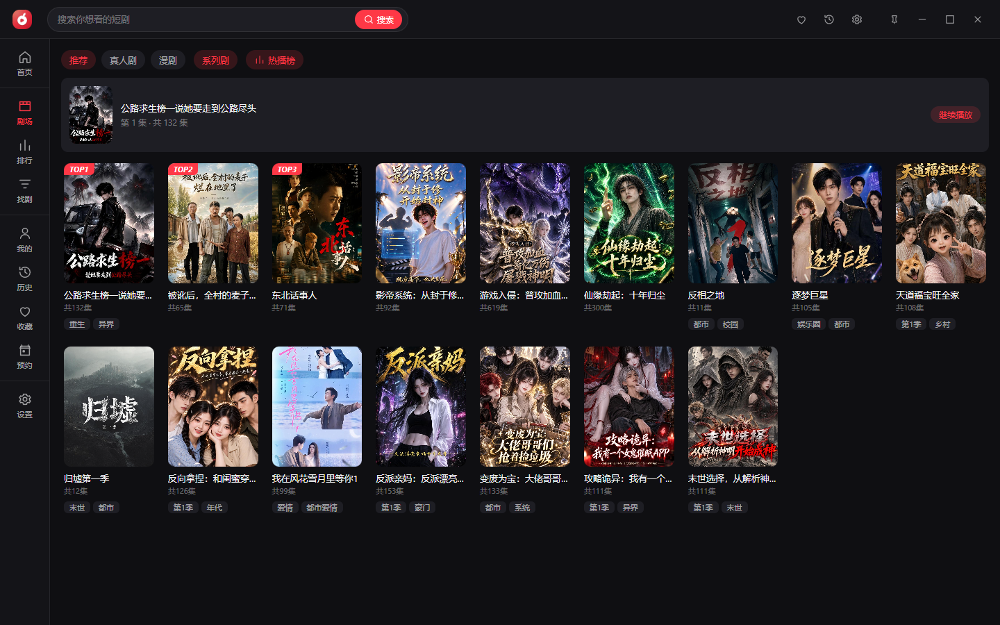
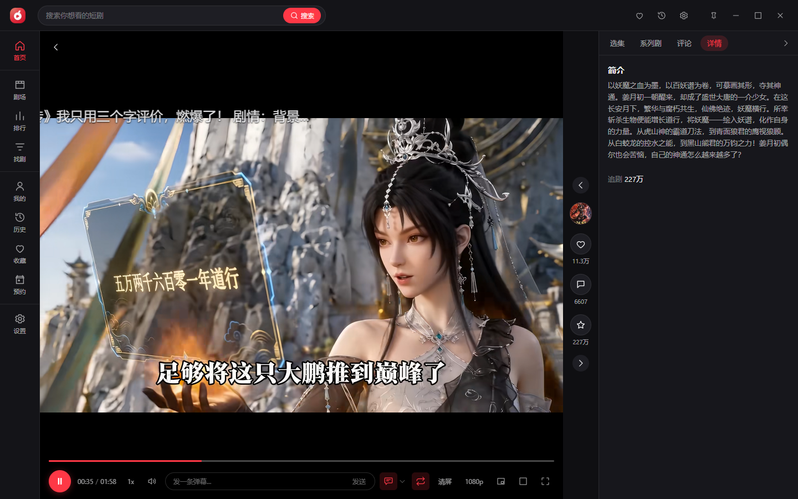
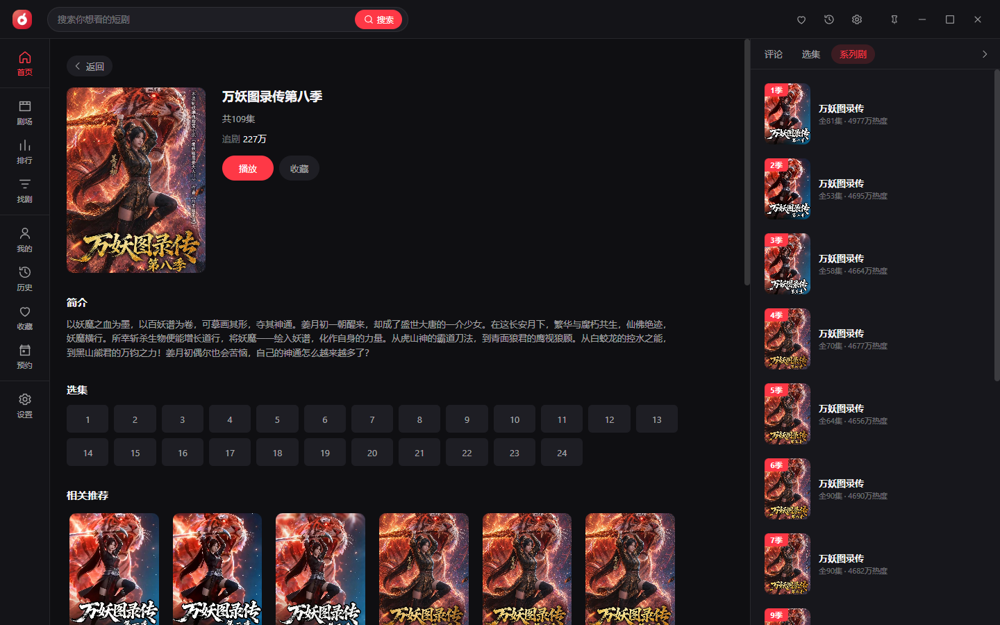
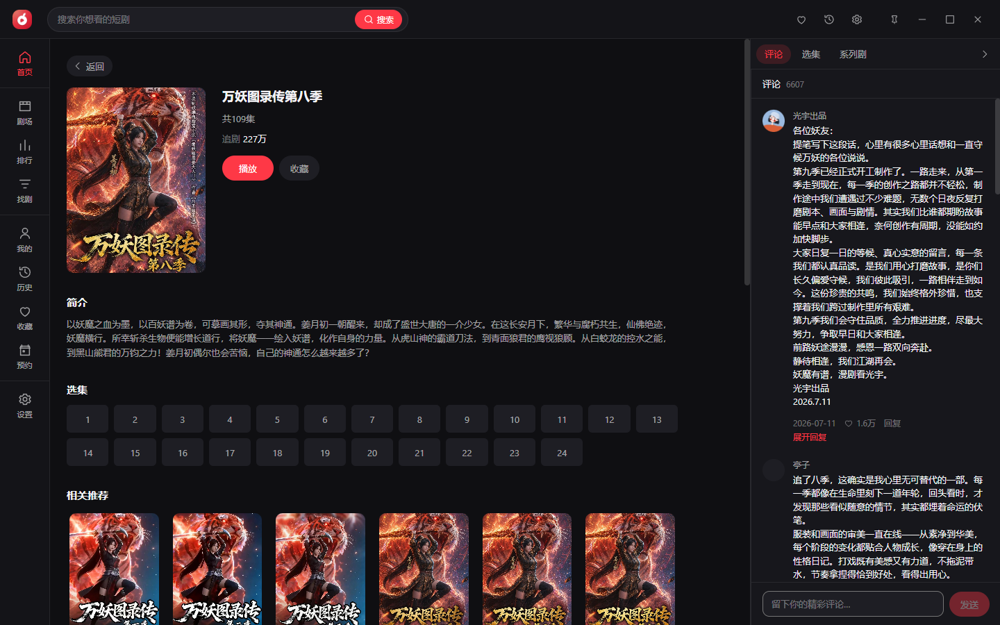
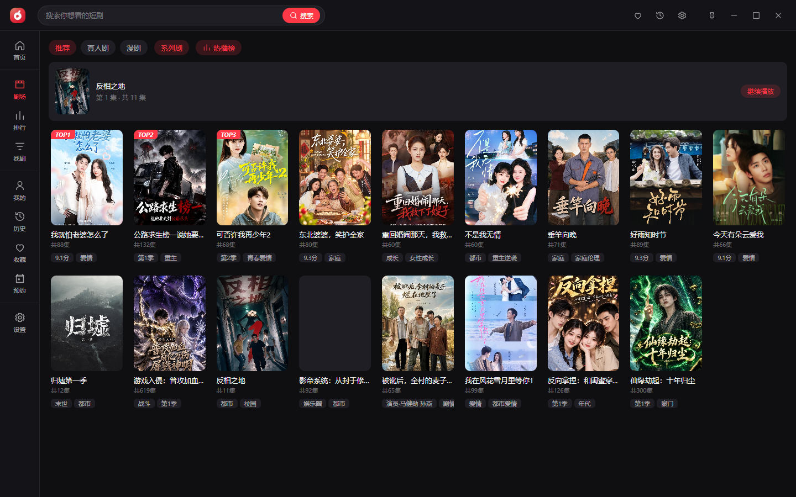
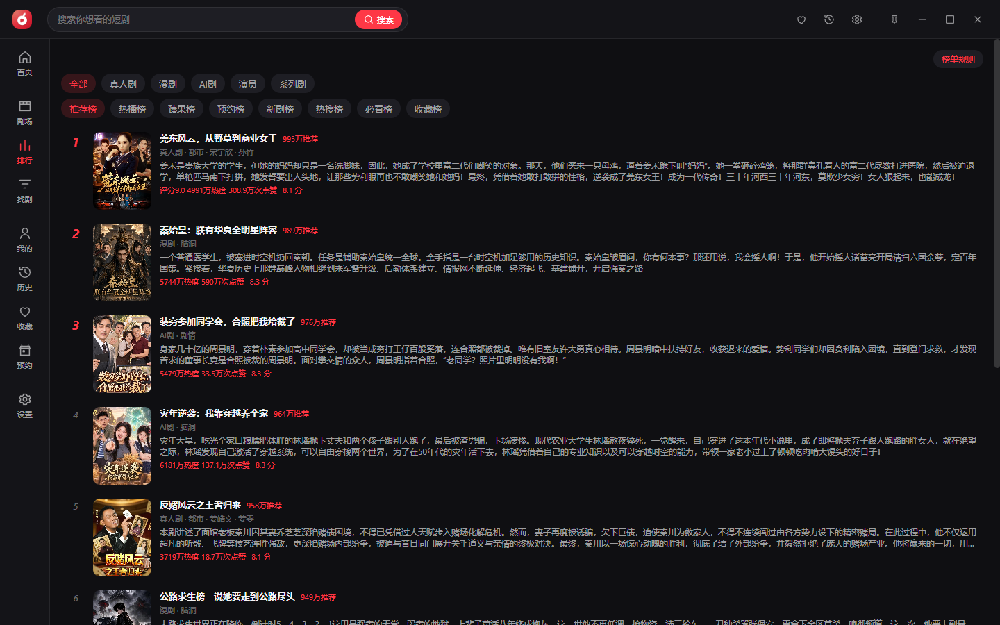
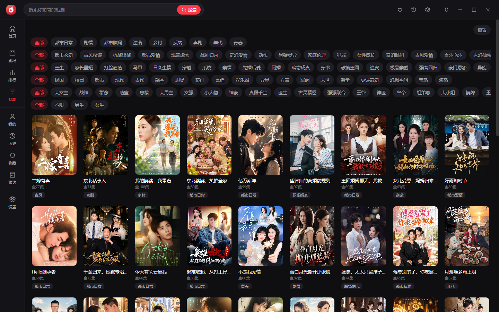
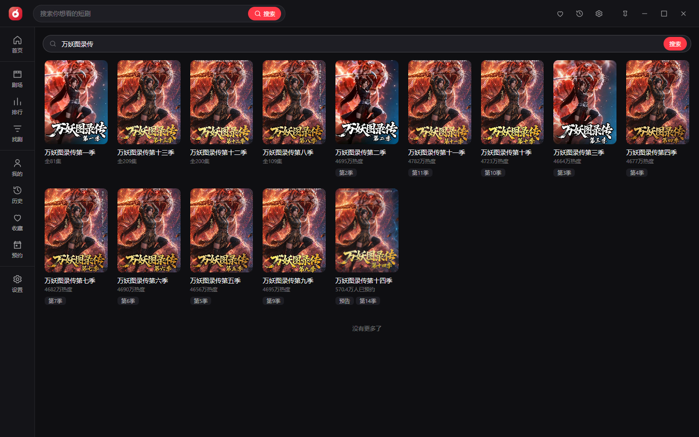
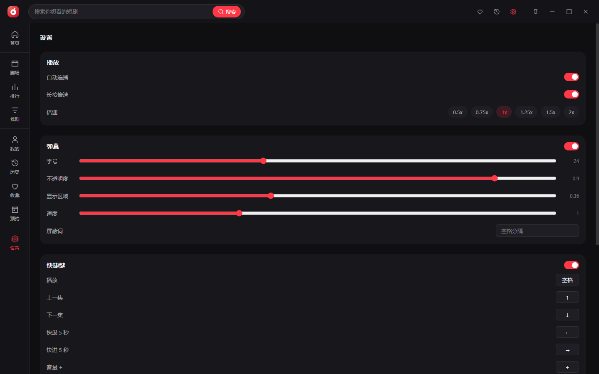

# 红果免费短剧（Windows 桌面端）

**[→ 下载最新版](https://github.com/liangzai-kk/hongguo-short-drama-desktop/releases/latest)**　Windows 10 1809+ · x64 · 约 169 MB

非官方第三方桌面客户端。本仓库只发布编译好的可执行文件与文档，**不公开源代码**。

---

## 界面

更多界面：剧场 / 排行榜 / 找剧 / 搜索 / 设置

截图中的剧集名称、海报、画面与评论内容，版权归其权利人所有，仅用于说明软件界面。

---

## 功能

| 模块 | 亮点 |
| --- | --- |
| 首页信息流 | 推荐 / 真人剧 / 漫剧 / 系列剧 / 热播榜五路内容；进中栏即播，推荐由内容服务端实时下发并跟随你的观看行为变化 |
| 剧场 / 排行 / 找剧 | 分类信息流、二级榜单、筛选项由服务端下发 |
| 搜索 | 关键词搜索；结果按系列归并，搜一部剧直接列出它的全部季 |
| 详情 / 系列剧 | 同一系列各季自动归组、按季号排序、未上线季可就地预约 |
| 播放 | 多档清晰度切换（切档保持进度）、相邻集预解码、进度记录与续播 |
| 弹幕 | 弹幕池由本集评论生成 + 自己发送的弹幕；字号 / 不透明度 / 速度 / 屏蔽词可调 |
| 评论 | 真实昵称与头像、分页加载、发表评论与回复（保存在本地） |
| 我的 | 收藏 / 历史 / 预约，全部保存在本机 |
| 窗口 | 小窗态、铺满窗口、全屏、置顶、自定义快捷键 |

完整清单与各项支持程度见 [docs/features.md](docs/features.md)。

---

## 安装

见 [docs/install.md](docs/install.md)。

## 文档

| 文件 | 内容 |
| --- | --- |
| [docs/features.md](docs/features.md) | 功能一览与各项实现程度 |
| [docs/install.md](docs/install.md) | 安装、卸载、升级、数据目录 |
| [docs/faq.md](docs/faq.md) | 常见问题 |

## 反馈

提 Issue，用仓库自带模板。不接受源码索取与功能定制请求。

---

## 声明

- **版权归属**：「红果短剧」「红果免费短剧」的名称、商标、标识、剧集内容及相关数据的一切权利，归红果短剧官方及其权利人所有。
- **项目性质**：非官方第三方客户端，与红果短剧官方及其关联公司**无任何关联**，未获其授权、许可或认可。
- **使用目的**：仅供个人学习、技术研究与交流，**禁止任何商业用途**。
- **下载后请于 24 小时内删除**；观看内容请使用官方 App。

完整条款见 [LICENSE](LICENSE) 与 [DISCLAIMER.md](DISCLAIMER.md)。
